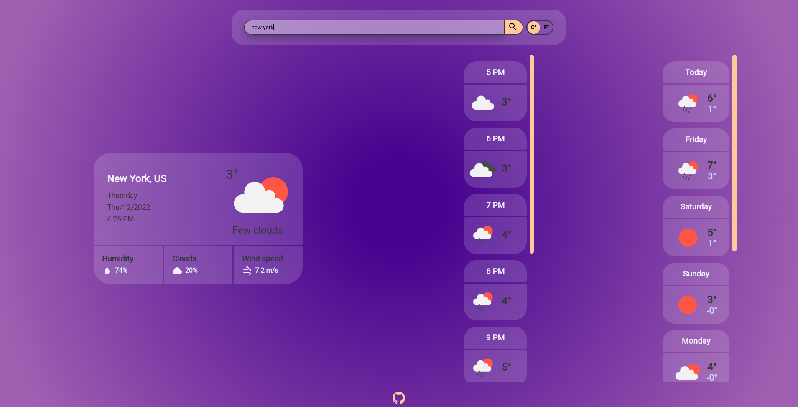

	<h1>Weather Application
	 
		
		
		
		
		 
	</h1>
	<h3> 👇 Live Demo 👇 </h3>

## 📝 Description
My take on building a simple Weather Web Application. 
-I made this app to practice my web API skills and other javascript functionalities. 
-I used the openweathermap API in this project.

## 🛠️ Built with
 * HTML5.
 * CSS.
 * Vanilla JavaScript.
 * Webpack.